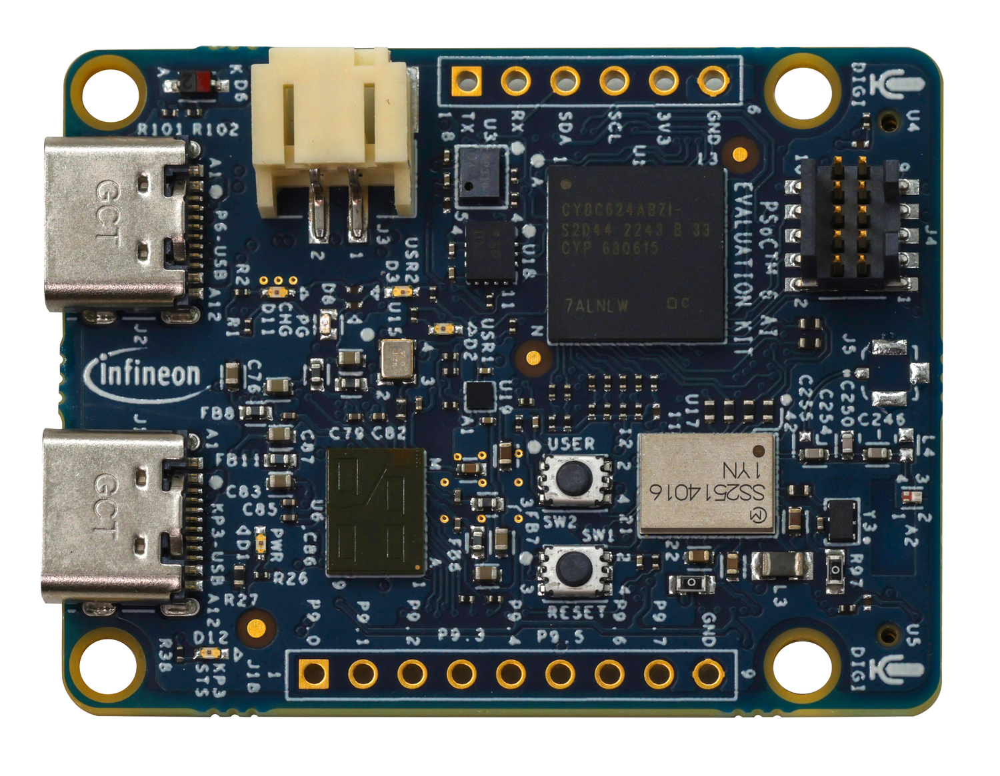
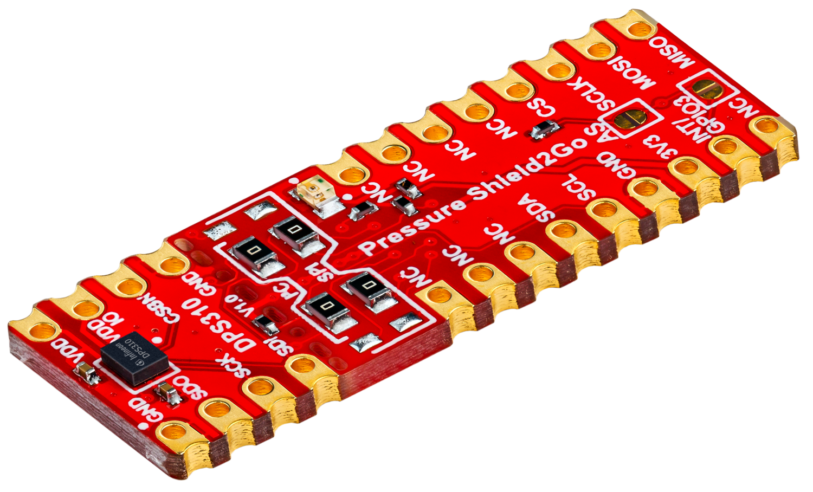

# MicroPython Driver for XENSIV™ DPS3xx Pressure Sensors

[](https://github.com/Infineon/micropython-xensiv-dps3xx/actions/workflows/check_links.yml)


With this library Infineon's XENSIV™ DPS3xx Pressure sensor can be configured
and used with [MicroPython](https://github.com/Infineon/micropython) via I2C.

Please refer to the product pages linked below for more information about the sensor and supported evaluation boards.

> [!NOTE]
> This project is work in progress and not covering all functions of the sensor yet.   
> If you are missing any functionality feel free to [contribute](https://github.com/Infineon/micropython-xensiv-dps3xx/fork) or [open an issue](https://github.com/Infineon/micropython-xensiv-dps3xx/issues).

### Supported Products

<table>
    <tr>
        <td></td>
        <td></td>
        <td></td>
        <td></td>
    </tr>
    <tr>
        <td style="test-align : center"><a href="https://www.infineon.com/part/DPS368">XENSIV™ DPS368/DPS310</a></td>
        <td style="test-align : center"><a href="https://www.infineon.com/evaluation-board/CY8CKIT-062S2-AI">PSOC™ 6 Artificial Intelligence Evaluation Kit</a></td>
        <td style="test-align : center"><a href="https://www.infineon.com/evaluation-board/KIT-DPS368-2GO">DPS368/DPS310 Kit 2Go</a></td>
        <td style="test-align : center"><a href="https://www.infineon.com/evaluation-board/KIT-DPS368-2GO">DPS368/DPS310 Shield2Go (end of life)</a></td>
    </tr>
</table>

## Getting Started

### MicroPython Firmware Installation
Before using this module, ensure that the MicroPython firmware is installed on your microcontroller.
If you are using a PSOC™ 6 board, you can find the installation instructions [here](https://ifx-micropython.readthedocs.io/en/latest/psoc6/intro.html#install-micropython-on-the-board).
If you have a different MicroPython-compatible board, please refer to the [official MicroPython documentation](https://docs.micropython.org/en/latest/).

### Installation of this Module

#### Using mip (recommended)

> [!NOTE]
> This method assumes that your MicroPython device is connected to the internet.
> If this is not the case, please refer to the manual installation instructions below.

You can install this module using [mip](https://docs.micropython.org/en/latest/reference/packages.html#installing-packages-with-mip),
MicroPython's built-in package manager:
```
import mip
mip.install('github:infineon/micropython-xensiv-dps3xx')
```

#### Manual Installation
- Download this file:
    - [DPS3xx.py](https://raw.githubusercontent.com/Infineon/micropython-xensiv-dps3xx/refs/heads/main/micropython-xensiv-dps3xx/DPS3xx.py)

And drag-and-drop them onto your MicroPython device using e.g. [Thonny IDE](https://thonny.org/) or any other suitable tool.

### Usage

Have a look at the [examples](examples/) folder for usage examples.